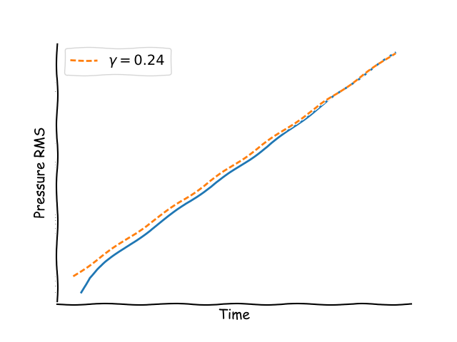

Along with version control, tests are essential to good practice for
developing software. Having tests makes it easier to reason about
changes, and ensure trust in the outputs of your code. And if you
can't trust your code, you can't trust the papers written using the
results...

(this is based on Peter Hill's talk at https://physicscodingclub.github.io/)
(also some from Charly's colleague's talk)

what to test? write spec
assertions
---

# Testing scientific code

- What are tests?
- Why are tests important?
- How to test your code
---

# What are tests?

- You might already test
- Run a "standard" case, eyeball the result, check a number
- This is a test!


---

# Why are tests important?

- Code is wrong → wrong results → bad things happen
    - Need to be confident of results
    - Bugs are a fact of life
- How do you change code?
    - Either _"Edit and Pray"_ or _"Cover and Modify"_
- Proper tests will:
    - Catch common bugs
    - Catch edge cases
    - Catch errors early
    - Reduce time to solution
    - Allow you to make changes confidently
    - Provide documentation - how to use code
---

<!-- # What to test

- You will    not get 100%    coverage    
- Focus on  anything    relevant    for your    results 
    - Data  handling    –>  Does    it  really  open    what    I   want?   
    – Maths –>  Are the calculations correct?    
    – Metadata  –>  Are my  timings  correct?    
• Bits that perform critical computations
• Bits that are hard to  understand  
 -->

## Types of test

- Unit tests
    - Test individual pieces (functions, subroutines, objects)
        - Modular code <==> Testable code
    - Make sure the important core stuff is right, e.g.
        - Statistical tests
        - Loss functions, Gradients
    - Useful as part of test driven development (TDD)
- Integrated tests
    - Test whole program at once (or large chunks)
    - Most likely do something like this already
    - “Known good” answer (“regression test”)

---

# How to test

## What does good testing look like?

- Cover as much of the code as possible
- Each test should cover as little as possible (localisation)
- Should run fast! (“1/10 second is too slow”)
    - Possible exception for integration/regression tests if necessary
- Should be automated as much as possible
- Should run as often as possible
    - Continuous integration tools (Travis CI, Jenkins)
- Example project setup
---

## What does a test look like?

- Different testing frameworks exist, but ultimately a test is a function that returns a boolean. (maybe exit code, assertion, ...)


```python
from numpy import isclose
from sys import exit

data = load_data()
answer = analyse_data(data)
real_answer = 0.24

if isclose(answer, real_answer):
    print("Test passed!")
    exit(0)
else:
    print("ERROR! Bad result")
    exit(1)
```

[/columns]
---

## What does a test look like?
- Regression version: no 'true' answer available...

```python
from numpy import isclose
from sys import exit

data = load_data()
answer = analyse_data(data)
ref_answer = load_reference_answer(data)

if isclose(answer, ref_answer):
    print("Test passed!")
    exit(0)
else:
    print("ERROR! Answer has changed! Was this intentional?")
    exit(1)
```

---

# How to test

## How do I get started testing legacy code? 
- Regression tests 
    - Am I still getting the same results as last week?
- Unit tests
    - Write unit tests for new code
    - Write unit tests before refactoring existing code
    - Write a test when you fix a bug - so you won't be bitten twice
---

## How do I get started testing new code?

- When you 'eyeball' a result, encode that in a test
    - Do the work once, catch all future bugs
- Test-driven development
    - Write tests first, then write code!
    - Looks like more effort to begin with, but then always confident of results
    - Write tests → Write simplest implementation → Debug/fix tests → Optimise
    - Find bug → Write test → Fix bug → Run test
- Pragmatic TDD 
    - As you write/hand-test your code, create real tests
    - As you plan your implementation todo list, think about what can be tested
---


# Resources:

- _Working Effectively with Legacy Code_ - MC Feathers (ISBN: 9780131177055)
- _Software Engineering for Science_ - JC Carver, NP Chue Hong, GK Thiruvathukal (ISBN: 9781498743853)
- _Dealing with Risk in Scientific Software Development_ - R Sanders, D Kelly (IEEE Software, 25(4), July 2008)

---

# Summary

## Good tests:

- Cover as much of the code as possible
- Each test should cover as little as possible (localisation)
- Should run fast! (“1/10 second is too slow”)
- Should be automated as much as possible
- Should run as often as possible

---

- Write tests
- Automate them

